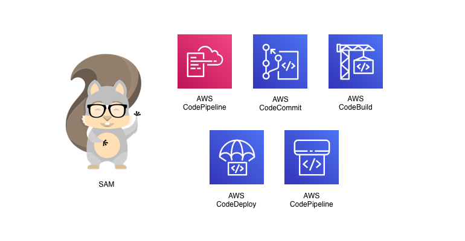

# CI/CD for Serverless Applications Workshop

In this workshop, you will learn how to start a new Serverless application from scratch using the AWS Serverless Application Model (AWS SAM) and how to fully automate builds and deployments by building a continous delivery pipeline using AWS CodeCommit, AWS CodeBuild and AWS CodePipeline. You will also learn how to test a Serverless application locally using the SAM CLI.

## Getting Started

[https://cicd.serverlessworkshops.io](https://cicd.serverlessworkshops.io)

## License

This library is licensed under the MIT-0 License. See the LICENSE file.

